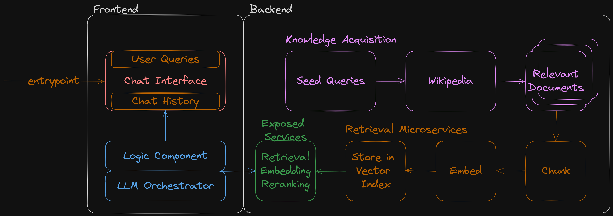

# RAG System for the Energy Utility Industry
## Demo
To run both backend and frontend, run the run.sh script in the root directory.
(You might need to change the script if you're not on a Unix-based system.)

```bash
chmod +x run.sh
./run.sh
```

The backend will be running on `http://localhost:8000` and the frontend will be running on `http://localhost:8080`.

# Solution Presentation
## Problem Statement
A RAG system allows users and stakeholders to access knowledge that is relevant to their role and responsibilities. The system should be able to provide a visual representation of the data that is easy to understand and interpret. The system should also be able to provide a way for users to interact with the data and provide feedback on the data that is being presented through a conversation interface.

## Solution


The backend is a fully modular and customizable system that can aquire data from multiple sources and provide a RESTful API to the frontend, it uses wikipedia right now, and needs a list of seed queries to start the data acquisition process. It has services related to processing the knowledge for ingestion by an LLM, including a retrieval endpoint that allows for searching the knowledge base, reranking results, and an embedding endpoint for low level access and interaction with the LLM.

The frontend is a simple conversational interface that handles two main issues, conversation history, it allows for state to be kept, and retrieval of data, it allows for the LLM to dynamically retrieve data from the backend and present it to the user in a conversational manner.

## Technical Design Choices
- FastAPI with Pydantic allow for robust and relaible APIs with the added bonus of automatically generated GUIs for documentation and testing.
- Sentence Transformers allows for access to any sentence embedding model with the option to switch at any given moment.
- FlashRank allows for the reranking of search results based on the user's preferences, without heavy PyTorch dependancies.
- Taipy allows for a simple and easy to use conversational interface that can be easily extended and customized.
- Wikipedia API Wrappers allow for easy access to the Wikipedia API and the ability to search and retrieve data from Wikipedia.
- Usearch allows for the serialization and loading of precomputed embeddings for fast retrieval and reranking of search results.

## Other Design Choices
- OpenAI serverless LLMs allow for the easy deployment and access to large language models without the need for heavy infrastructure.
- Docker allows for the easy deployment and scaling of the backend and frontend for scale and reliability.

## Code Documentation
The code is well documented and split into multiple modules for easy access and understanding.

## Conclusion
This solution offers a hybrid of proof of concept and full implementation, it is a fully functional system that can be easily extended and customized to fit the needs of any organization. It is a robust and reliable system that can be easily deployed and scaled to meet the needs of any organization.